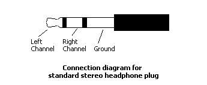
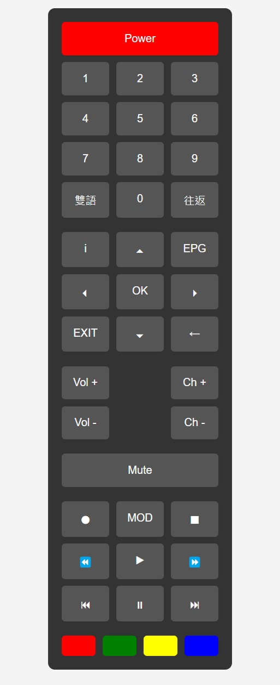

# ESP IR Remote

## Introduction

The **ESP IR Remote** project allows you to control a KBro TV box using a web interface hosted on an ESP8266 microcontroller (such as a NodeMCU). The KBro TV box has a 3.5mm IR extender jack that can be utilized to pass the simulated IR signals for remote control. This project leverages the ESP8266 to generate the required IR signals and send them through the IR extender jack, enabling remote control functionality through a web browser.

## Features

- Control the KBro TV box from any web browser on the same network.
- Easily send IR signals using a web-based interface.
- Flexible button layout that can be customized to match the original remote.
- Supports multiple all functions from the original remote.

## Wiring

After some experimentation with the IR extender jack of the KBro TV box, I discovered the following wiring configuration:


### Stereo Jack Schematic

The 3.5mm stereo jack (TRS) typically has three connections: **Tip (T)**, **Ring (R)**, and **Sleeve (S)**. In the case of the KBro TV box IR extender jack, the pinout is as follows:



- **Right Channel (Signal):** This is connected to the GPIO pin of the ESP8266 that outputs the IR signal (via an IR LED or direct output).
- **Left Channel (VCC 5V):** This provides 5V power and can be used to power the ESP8266 or as a reference.
- **Ground:** The ground pin should be connected to the common ground of the ESP8266.

## IR Signal Capture

The IR signal from the original remote is captured by [IR_capture](./IR_capture/IR_capture.ino). This capturer is based on [IRremoteESP8266/IRrecvDumpV3](https://github.com/crankyoldgit/IRremoteESP8266/tree/master/examples/IRrecvDumpV3) with slight modifications. The capturer will capture the received signal and output the data in the following format:

```
Timestamp : 000425.113
Library   : v2.8.6

Protocol  : XMP
Code      : 0x1B0F445810000F00 (64 Bits)
uint16_t rawData[35] = {234, 890,  218, 2298,  194, 778,  194, 2824,  220, 1328,  196, 1348,  176, 1468,  194, 1876,  194, 13546,  234, 892,  216, 754,  218, 778,  194, 752,  218, 778,  194, 2824,  218, 778,  194, 746,  220};  // XMP 1B0F445810000F00
uint64_t data = 0x1B0F445810000F00;


Timestamp : 000425.236
Library   : v2.8.6

Protocol  : XMP (Repeat)
Code      : 0x1B0F445818800F00 (64 Bits)
uint16_t rawData[35] = {234, 916,  194, 2270,  220, 754,  218, 2824,  218, 1330,  194, 1306,  218, 1466,  194, 1852,  218, 13544,  234, 916,  194, 1856,  220, 1858,  218, 776,  194, 778,  194, 2822,  220, 776,  194, 746,  220};  // XMP (Repeat) 1B0F445818800F00
uint64_t data = 0x1B0F445818800F00;
```

From this information, we know the protocol is **XMP**, and the data for this key is `0x1B0F445810000F00`.

## IR Remote

The IR remote consists of a web interface that replicates the layout of the original remote and an IR signal transmission core that emulates its functionality.




Each button is assigned with an ID, and the web interface uses this ID to trigger the ESP8266 to emit the corresponding IR signal.
